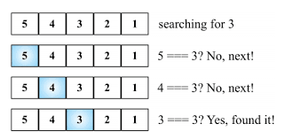
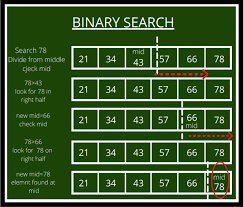

# Search Alogrithms


## Table of Contents

1. [Definition of Search](#Definition-of-Search)
2. [Linear Search](#Linear-Search)
3. [Binary Search](#Binary-Search)

---

## Definition of Search
- A systematic method for finding a particular item or value (Target )within a given set of data(Search space).
- It involves looking through a collection of data to locate a specific element that matches certain criteria, often referred to as the target.
- Common terms used are:
    1. Search space: Means set of data in which the search is conducted. Can be array, database or list
    2. Target : Refers to the specific item in which the search seeks to find
- Common search algorithms will be discussed below

## Linear Search
- It is the simplest searching algorithm
- It involve finding the target by sequentially checking each element in the given set of data until a match is found or entire collection is traversed.

    ### How it Works:
    - Every element is considered as a potential match for the key and checked for the same.
    - If any element is found equal to the key, the search is successful and the index of that element is returned.
    - If no element is found equal to the key, the search yields “No match found” or normally we return -1.

        **Steps**
    1. Initialization: Begin by initializing a index variable to the first element of the collection.
    2. Comparison: It then compares the target value with the current element at the index.
    3. Checking match: If the current element matches the target value, the search process ends, and the index or position of the match is returned.
    4. Move: If no match is found, the index is incremented to move to the next element in the collection
    5. Repeat: Steps 2-4 are repeated until either a match is found or the end of the collection is reached.

    ### Diagramatic Representation
    - Linear Search where target is 3
    

    ### Linear Search Algorithm Implementation
    ```java
        public static int linearSearch(int[] array, int target) {
        // Iterate through each element in the array
        for (int i = 0; i < array.length; i++) {
            // If the current element matches the target, return its index
            if (array[i] == target) {
                return i;
            }
        }
        // If the target is not found, return -1
        return -1;
    }
    ```

## Binary Search
- It is an efficient algorithm for finding an item from a *sorted list* of items.
-  It follows the principle of divide and conquer, reducing the search space by half with each comparison.
- It is significantly faster than Linear Search for *large dataset* because it eliminates half of the remaining elements in each step
    
    ### How it Works
    - It works by repeatedly dividing in half the portion of the list that could contain the item, until you've narrowed down the possible locations to just one.

        **Steps**
        1. If the set of data is sorted continue to step two or else sort first
        2. Compare the target value to the value at the middle
        3. If the target value is equal to the value at the middle index, return the middle index.
        4. If the target value is less than the value at the middle index, eliminate the upper half of the array and repeat steps 2-4 with the remaining lower half.
        5. If the target value is greater than the value at the middle index, eliminate the lower half of the array and repeat steps 2-4 with the remaining upper half.
        6. Repeat steps 2-5 until the target value is found or the array is exhausted.
    
    ### Diagramatic Representation
    - Binary Search where target is 78
    

    ### Binary Search Algorithm Implementation
    ```java
      public static int binarySearchIterative(int[] array, int target) {
        int low = 0;
        int high = array.length - 1;
        
        while (low <= high) {
            int mid = low + (high - low) / 2;
            
            if (array[mid] == target) {
                return mid; // Element found, return its index
            } else if (array[mid] < target) {
                low = mid + 1; // Search the right half if middle value less than target
            } else {
                high = mid - 1; // Search the left half if middle value greater than target
            }
        }
        
        return -1; // match not found
    }
    ```
